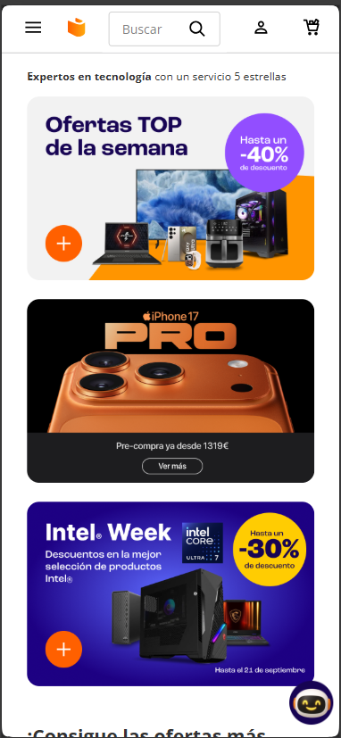
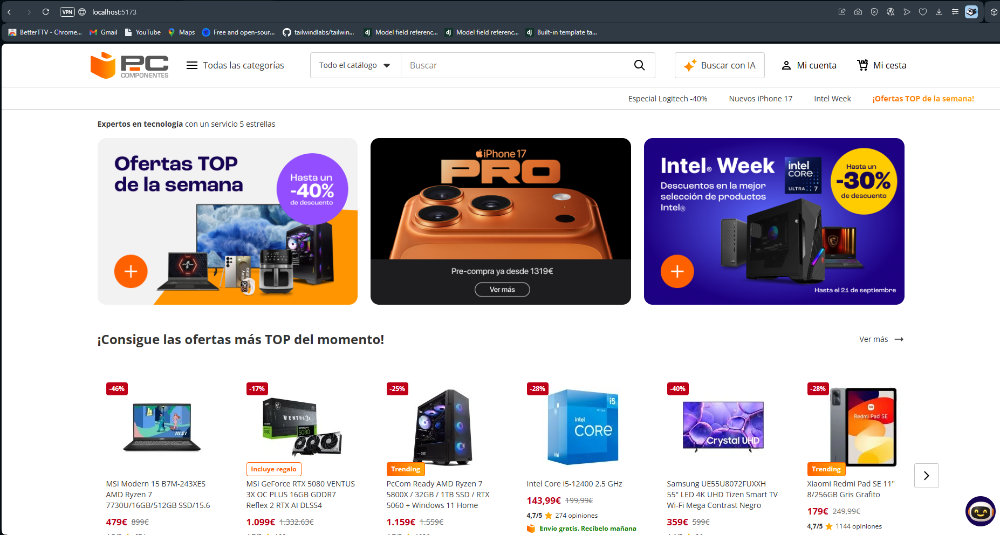

# 🛒 Clon de PcComponentes


Este proyecto es un clon visual (front-end) del popular e-commerce español [PcComponentes](https://www.pccomponentes.com/). El objetivo principal es replicar la interfaz de usuario y la experiencia de navegación utilizando únicamente **React** y **Tailwind CSS**.

Este es un proyecto con fines educativos y de portafolio, no tiene ninguna funcionalidad de back-end (no se pueden comprar productos) y no está afiliado a PcComponentes.

## 🚀 Demo en Vivo

**[Enlace a tu proyecto en Vercel aquí]**

## 📸 Capturas de Pantalla

*(Añade aquí tus capturas de pantalla. Súbelas a tu repositorio y enlaza a ellas)*

| Móvil | Escritorio |
| :---: | :---: |
|  |  |

## ✨ Características Principales

-   **Responsive Design:** La interfaz se adapta completamente a tamaños de móvil, tablet y escritorio.
-   **Componentes Reutilizables:** Creado con una arquitectura de componentes de React.
-   **Estilos con Tailwind:** Todo el CSS está escrito con clases de utilidad de Tailwind CSS.
-   **UI Replicada:**
    -   Header y barra de navegación.
    -   Menús desplegables (como el de categorías).
    -   Carruseles de productos.
    -   Rejilla (Grid) de productos.
    -   Footer completo con secciones desplegables (acordeón) para móvil.

## 🛠️ Tecnologías Utilizadas

-   **[React](https://reactjs.org/):** Biblioteca principal para la construcción de la interfaz de usuario.
-   **[Tailwind CSS](https://tailwindcss.com/):** Framework de CSS utility-first para todo el estilizado.
-   **[Vite](https://vitejs.dev/) (o Create React App):** Herramienta de construcción y servidor de desarrollo.
-   Hay que crear un .env con el api key de chatGpt llamándolo VITE_OPENAI_API_KEY, la versión utilizada es gpt-4o-mini

## 📦 Instalación y Puesta en Marcha

Si deseas ejecutar este proyecto en tu máquina local, sigue estos pasos:

1.  **Clona el repositorio:**
    ```bash
    git clone https://github.com/Jhon0507/ClonePcComponentes.git
    ```

2.  **Navega al directorio del proyecto:**
    ```bash
    cd frontend
    ```

3.  **Instala las dependencias:**
    ```bash
    npm install
    ```
    o si usas Yarn:
    ```bash
    yarn install
    ```

4.  **Ejecuta el servidor de desarrollo:**
    ```bash
    npm run dev
    ```
    o si usas Create React App:
    ```bash
    npm start
    ```

5.  Abre [http://localhost:5173](http://localhost:5173) (para Vite) o [http://localhost:3000](http://localhost:3000) (para CRA) en tu navegador.
